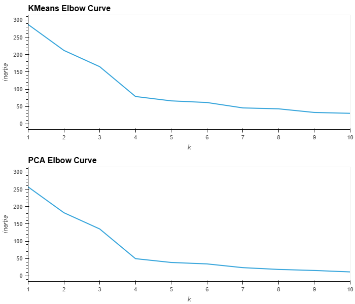
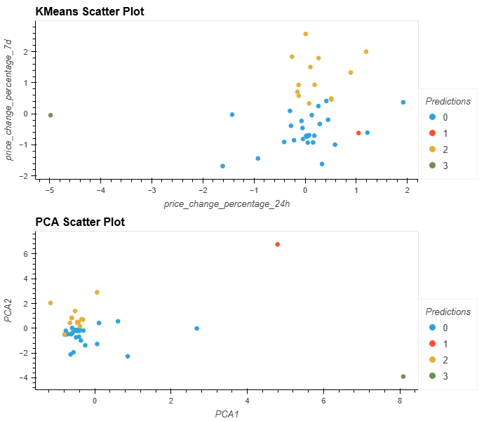

# Crypto-Clustering
Unsupervised Machine Learning - Data Analytics Course Module 19

# Task
Predict if cryptocurrencies are affected by 24-hour or 7-day price changes.

# Methodology
1. Prepare the Data: Use StandardScaler() from scikit-learn to normalize the data from the CSV file.
2. Using the original scaled dataframe, find the best value for k using the elbow method and cluster cryptocurrencies with K-means.
3. Optimize clusters with Principal Component Analysis (PCA) and use this new dataframe to find the best value for k using the elbow method, and cluster cryptocurrencies with K-means.
4. Create composite plots of the elbow line graphs and scatter plots.

## Results
### Composite Plot: KMeans + PCA Elbow Plots

_The elbow plots indicate that **the best value for k is 4** whether using the original scaled data and the PCA data._

### Composite Plot: KMeans and PCA Scatter Plots

## Analysis

- The scatter plots indicate that about 90% of the cryptocurrencies fall into two clusters (0 and 2) with two outlier clusters (1, 3) that contain one cryptocurrency each.
  
  - **Question:** What is the total explained variance of the three principal components?

  - **Answer:** About 90% of the total variance is contained in the three principal components.
    
      - array([0.3719856 , 0.34700813, 0.17603793])
        
- Cluster 0 (blue): The KMeans scatter plot clearly shows that at *24 hours*, cyrptocurrencies in cluster 0 are *quite volatile* with a price change percentage between -1.6 and 1.9 but become *slightly less volatile* at the *7 day* mark (price change percentage lies between -1.7 and .4).

- Cluster 2 (yellow): The KMeans scatter plot clearly shows that at *24 hours*, cyrptocurrencies in cluster 2 are *somewhat stable* with a price change percentage between -.25 and 1.2 but become *more volatile* at the *7 day* mark (price change percentage lies between .35 and 2.6).

  - **Question:** After visually analyzing the cluster analysis results, what is the impact of using fewer features to cluster the data using K-Means?
  
  - **Answer:** Using fewer features allowed the clusters to be tighter and for the outliers to be more pronounced and separate from the larger clusters.
